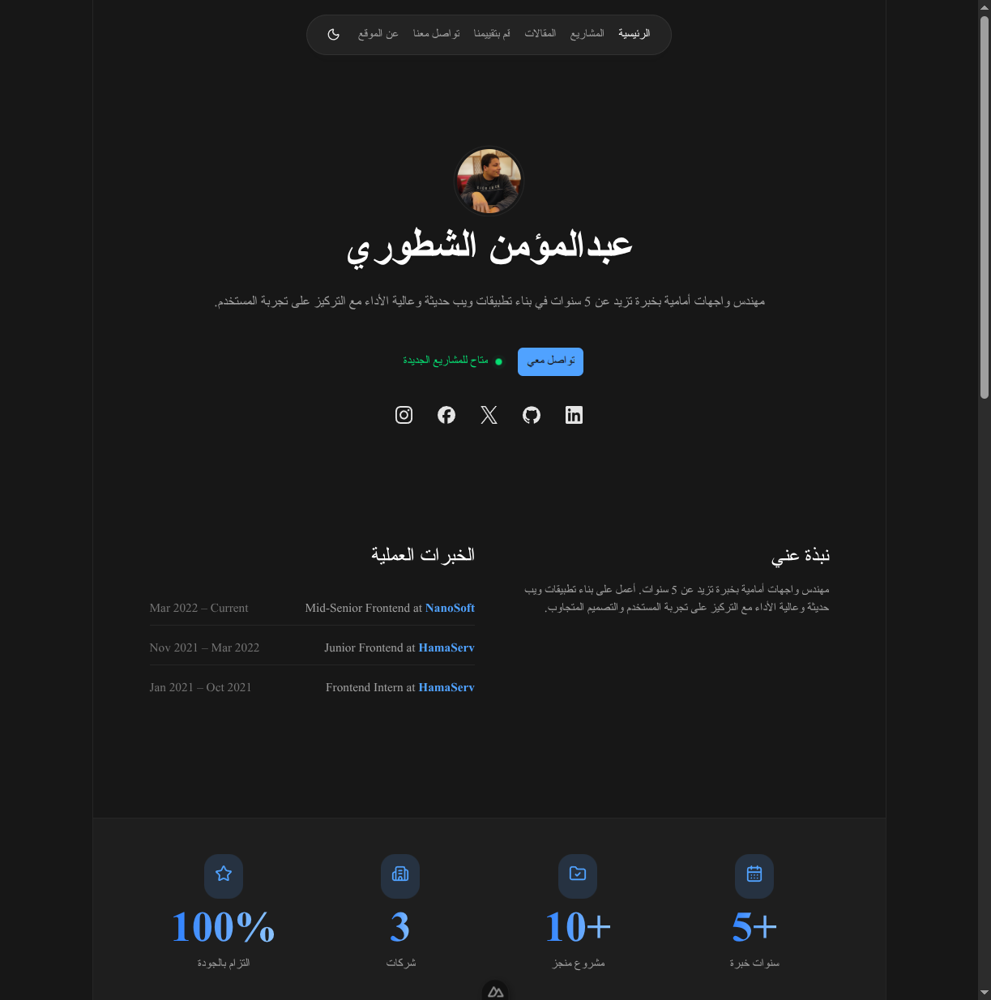

# beingmomen.com — Portfolio

Personal portfolio website for **Abdelmomen Elshatory** (عبدالمؤمن الشطوري), a Frontend Engineer with 5+ years of experience building modern, high-performance web applications.



## Tech Stack

- **Framework:** Nuxt 4.3 + Vue 3
- **UI:** Nuxt UI 4 (125+ components)
- **Styling:** Tailwind CSS v4
- **Animation:** Motion V (Vue motion library)
- **Images:** Cloudinary via @nuxt/image
- **Fonts:** Tajawal (Arabic) + Space Grotesk (Latin)
- **SEO:** @nuxtjs/seo (sitemap, robots, schema.org, og-image)
- **Validation:** Joi
- **Language:** Arabic RTL primary

## Prerequisites

- Node.js v24.13.0 (see `.nvmrc`)
- pnpm 10.29+

## Setup

```bash
pnpm install
```

Create a `.env` file:

```env
BASE_URL=           # Backend API base URL
SITE_URL=           # Public site URL
PORT=               # Server port
CLOUDINARY_CLOUD_NAME=
CLOUDINARY_UPLOAD_PRESET=
CLOUDINARY_API_KEY=
CLOUDINARY_URL=
LOGO=               # Site logo URL
```

## Development

```bash
pnpm dev            # Start dev server (port 3000)
```

## Build & Production

```bash
pnpm build          # Build for production
pnpm preview        # Preview production build locally
```

### PM2 Deployment

```bash
pnpm build
pm2 start ecosystem.config.cjs
```

## Linting

```bash
pnpm lint           # Run ESLint
pnpm lint:fix       # Auto-fix lint issues
pnpm typecheck      # Run type checking
```

## Pages

| Route | Description |
|-------|-------------|
| `/` | Landing page (hero, about, skills, services, experience, testimonials, blog, FAQ) |
| `/blog` | Blog list with card grid |
| `/blog/[slug]` | Single blog with sidebar + table of contents |
| `/about` | About page with polaroid gallery |
| `/projects` | Projects grid |
| `/contact` | Contact form with Joi validation |
| `/testimonial` | Testimonial submission form with Cloudinary upload |
| `/sdlc` | SDLC Visual Framework (English) |
| `/sdlc-ar` | SDLC Visual Framework (Arabic) |

## Project Structure

```
app/
├── assets/css/          # Global styles (Tailwind, typography)
├── components/
│   ├── landing/         # Landing page sections
│   ├── blog/            # Blog sidebar & TOC
│   ├── sdlc/            # SDLC English components
│   ├── sdlc-ar/         # SDLC Arabic components
│   ├── common/          # Social links
│   └── form/            # File upload components
├── composables/         # Data fetching & utilities
├── layouts/             # Default layout (header + footer)
├── pages/               # File-based routing
├── plugins/             # $api helper plugin
└── utils/               # Clipboard, navigation links
server/
├── api/                 # Blog proxy, sitemap URLs
├── og-image/            # Arabic OG image template
└── plugins/             # EPIPE error handler
```

## Data Flow

```
Pages → Composables → useApiRequest → $api plugin → Backend API
```

## License

All rights reserved.
